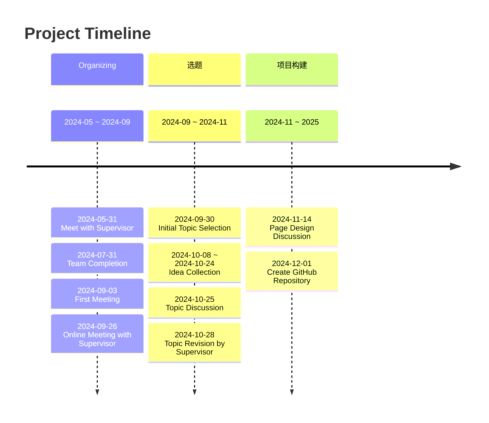

# China's Charm of Mountains and Water

> English | [简体中文](README_CN-zh.md)

## Introduction

This is a project for the 2025 Chinese Collegiate Computing Competition.

> **Official Website** of CCCC : [Link](https://jsjds.blcu.edu.cn/index.htm)

### Technology Stack


```
Frontend: React

Backend: Node.js + Express

Database: MongoDB

Operating System: Linux

Development Tools: VSCode + Git

Cloud Platform: Aliyun

```

## Timeline


