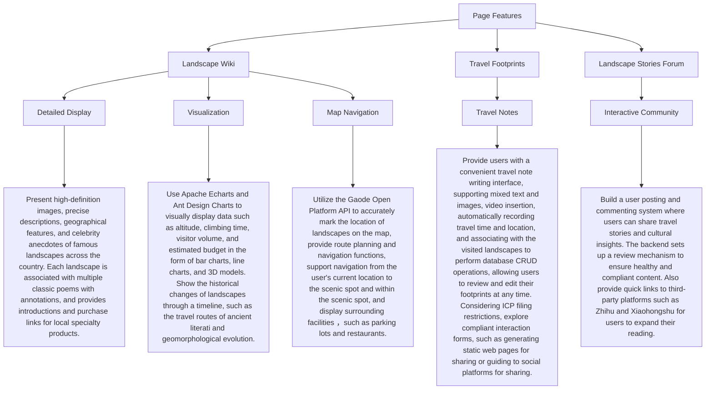
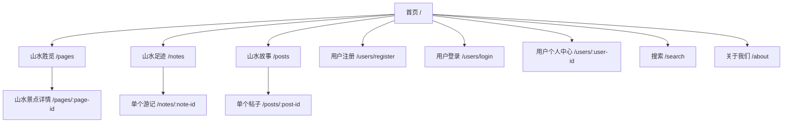
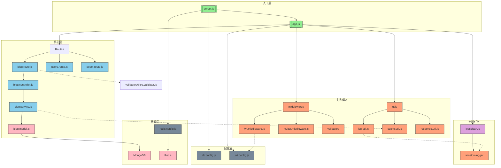

<h1  align="center">China's Charm of Mountains ⛰️ and Water 💧</h1>

[](https://github.com/2311719626/CCCC_Project)

> English | [简体中文](/Other/README.zh-CN.md)

## Introduction

This is a project for the 2025 Chinese Collegiate Computing Competition (CCCC), aiming to showcase the charm of China's landscapes.

> **Official Website** of CCCC : [Link](https://jsjds.blcu.edu.cn/index.htm)

## Technology Stack

### Frontend

[](https://nodejs.org/)
[](https://www.npmjs.com/)
[](https://code.visualstudio.com/)
[](https://reactjs.org/)
[](https://reactjs.org/)
[](https://material-ui.com/)
[](https://zustand-demo.pmnd.rs/)
[](https://getbootstrap.com/)
[](https://vitejs.dev/)

### Backend

[](https://nodejs.org/)
[](https://expressjs.com/)
[](https://www.mongodb.com/)
[](https://redis.io/)
[](https://www.apifox.cn/)
[](https://github.com/Molunerfinn/PicGo)
[](https://code.visualstudio.com/)
[](https://pm2.keymetrics.io/)

## Features



## Web Page Routes



## Announcement

This project is licensed under the `Apache 2.0` Open Source License.

In compliance with the open source license, this code can be used in various scenarios. However, it must not be copied and presented as personal work for competition purposes.

## Sub-repository

[](https://github.com/2311719626/CCCC_Pic)

> Implement an image bed in combination with PicGo.

---

## Code Reading Guide

### Backend Core Code

> Backend\src

```
Backend/
├── .env                # 环境配置
├── .gitignore          # Git忽略规则
├── package.json        # 依赖配置
├── src/                # 核心代码
│   ├── config/         # 系统配置
│   ├── controllers/    # 业务控制器
│   ├── middlewares/    # 中间件
│   ├── models/         # 数据模型
│   ├── routes/         # API路由
│   ├── services/       # 业务服务
│   ├── utils/          # 工具类
│   └── server.js       # 服务入口
├── public/             # 静态资源
└── tests/              # 测试用例
```

