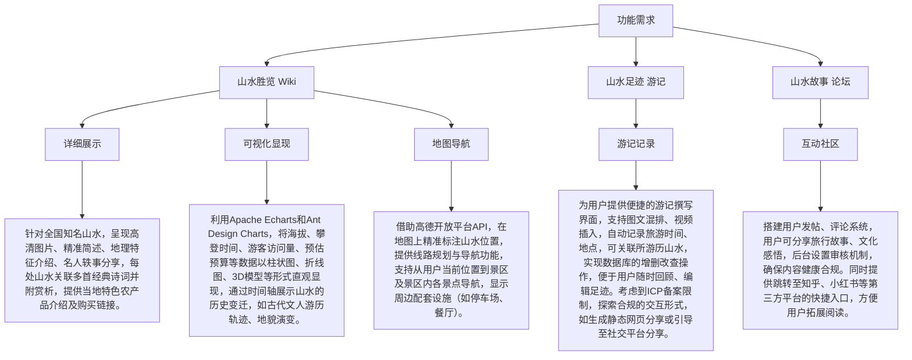
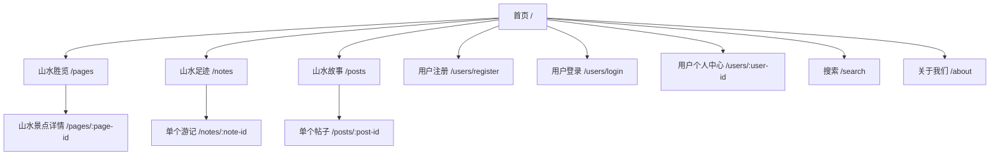

<h1 align="center">⛰️💧 山水韵中国</h1>

> [English](./README.md) | 简体中文

## 介绍

这是一个为 2025 年中国大学生计算机竞赛（CCCC）准备的参赛项目，旨在展示中国山水的魅力。

> 中国大学生计算机设计大赛 **官网**：[链接](https://jsjds.blcu.edu.cn/index.htm)

## 技术栈

### 前端

### 后端

## 特性

## 页面路由

## 声明

本项目使用 `Apache 2.0` 开源协议。

在遵守开源协议的基础下，可以在各种场景下使用此代码，但是不得复制此代码作为个人作品参与比赛。

## 子仓库

> 结合 PicGo 实现图床功能。
