<h1 align="center">⛰️💧 山水韵中国</h1>

> [English](./README.md) | 简体中文

## 介绍

这是 CCCC-2025 的参赛项目。

> 中国大学生计算机设计大赛 **官网**：[链接](https://jsjds.blcu.edu.cn/index.htm)

## 技术栈

[](https://reactjs.org/)
[](https://nodejs.org/)
[](https://expressjs.com/)
[](https://www.mongodb.com/)
[](https://cn.ubuntu.com/)
[](https://code.visualstudio.com/)
[](https://git-scm.com/)
[](https://www.aliyun.com/)

```
前端：React

后端：Node.js + Express

数据库：MongoDB

操作系统：Ubuntu

开发工具：VSCode + Git

云服务平台：Aliyun
```

## 时间线

```mermaid
timeline
    title 项目时间线
    section 组织
        2024-05 ~ 2024-09:
        2024-05-31<br>见面指导老师:
        2024-07-31<br>组队完成:
        2024-09-03<br>第一次见面会:
        2024-09-26<br>导师线上会议
    section 选题
        2024-09 ~ 2024-11:
        2024-09-30<br>初步选题:
        2024-10-08 ~<br> 2024-10-24<br>idea 采集:
        2024-10-25<br>选题讨论:
        2024-10-28<br>导师修改选题
    section 项目构建
        2024-11 ~ 2025<br>:
        2024-11-14<br>页面设计讨论:
        2024-12-01<br>创建 GitHub 仓库
```



## 声明

本项目使用 Apache 2.0 开源协议

在遵守开源协议的基础下，可以在各种场景下使用此代码，但是不得复制此代码作文个人作品参与比赛。
