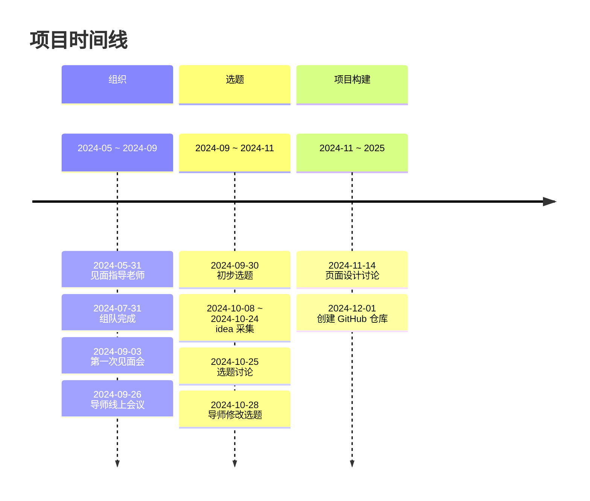

# 山水韵中国

> [English](./README.md) | 简体中文

## 介绍

这是 CCCC-2025 的参赛项目。

> 中国大学生计算机设计大赛 **官网**：[链接](https://jsjds.blcu.edu.cn/index.htm)

### 技术栈


```
前端：React

后端：Node.js + Express

数据库：MongoDB

操作系统：Linux

开发工具：VSCode + Git

云服务平台：Aliyun
```

## 时间线


